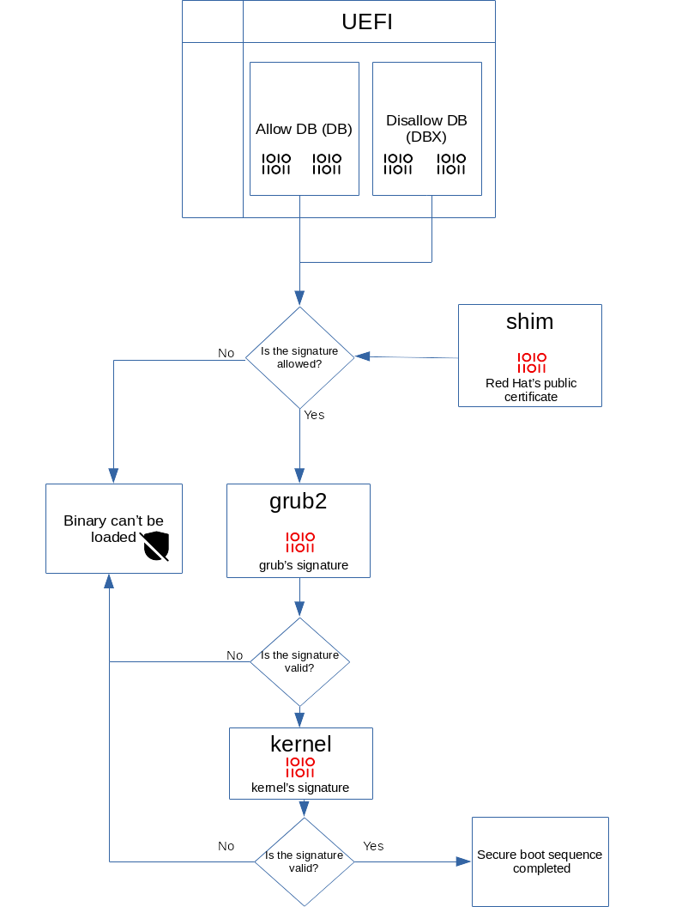

---
layout:
  title:
    visible: true
  description:
    visible: false
  tableOfContents:
    visible: true
  outline:
    visible: true
  pagination:
    visible: true
---

# Secure boot

Secure Boot is a UEFI firmware security feature developed by the [UEFI Consortium](https://uefi.org/) that ensures only immutable and signed software are loaded during the boot time.

## Components

(Not necessary hardware components)

### DB - Allowed signatures DB

Stores keys (X.509 public key certificates) or hashes (sha256) for trusted loaders and EFI applications that are allowed to be loaded by the machine’s firmware.

### DBX - Disallowed signatures DB

Stores revoked, compromised, and non-trusted keys and hashes. Any attempt to load signed code using the Disallow DB keys or in the case where the hash matches a Disallow DB entry will lead to boot failure.

Entries here are typically hashes of specific UEFI binaries, i.e. those things that were signed by a certificate in the **DB** but later found to be bad (e.g. having a security vulnerability that compromises the firmware). So this is a “block” list.

### PK - Platform key DB

Public keys used to verify the signatures of bootloader or firmware.

This key is typically set by the platform manufacturer when a system is built in the factory. While it may be replaceable by an end user or enterprise IT services, its purpose is to protect the next key from uncontrolled modification

### **KEK -** Key Enrollment Key DB

The KEKs protect the signature DBs (**DB** and **DBX**) from unauthorized modifications.

### MOK - Machine Owner Key

Managed by the user, usually located in /var/lib/shim-signed/mok/

### Shim

EFI application, early stage bootloader, signed by Microsoft, embeds a Canonical (or Red Hat, etc.) certificate as its own certificate database. For example, the GRUB binary is usually signed by this certificate.

<figure><figcaption></figcaption></figure>

UEFI will allow a binary to execute if:

* It is signed by a key in the **DB**, or explicitly has its hash in the **DB** (so you can allow a single binary if you want).
* It is signed by a key in the **KEK** (which seems to be uncommon).
* Its hash isn’t in the **DBX**.

## UEFI variables

### Boot variables

Used by bootloader and early system start-up

### Runtime variables

Allows OS to manage settings of the firmware

## How to

### Read UEFI variables

```
efivar -l
efivar -p --name <name>
```

Variables are also available via sysfs (but their value is not directly readable)

```
/sys/firmware/efi/efivars
```

### List UEFI variable-GUIDs

```
efivar -L
```

### List UEFI signature database

```
efi-readvar
```

