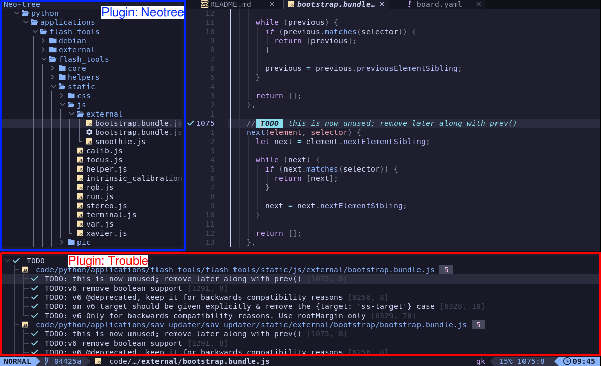
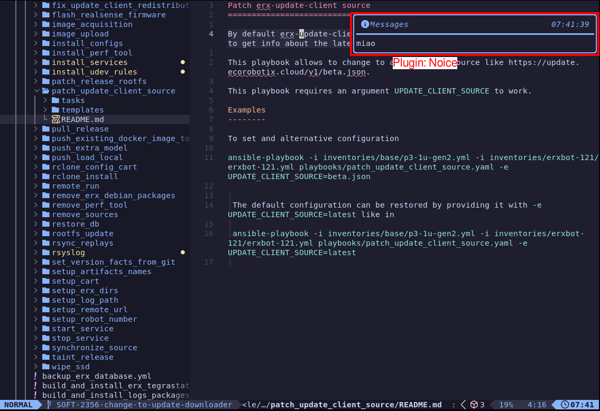

---
layout:
  title:
    visible: true
  description:
    visible: false
  tableOfContents:
    visible: true
  outline:
    visible: true
  pagination:
    visible: true
---

# Neovim

## Files and configs

### Stadard paths

[https://practical.li/neovim/reference/neovim/standard-path/](https://practical.li/neovim/reference/neovim/standard-path/)

* Config: `~/.config.nvim/`
  * User configs
* Data: `~/.local/share/nvim/`
  * Plugins
* Run: `/tmp/nvim.user/xxx/`
* State: `~/.local/state/nvim/`
  * Logs
  * Sessions
  * Undo data

## Mappings

See mappings

```
:map
```

## Registers mini-mode

In **INSERT** mode type `<C-R>`

## Do commands

Apply action to

* argdo: all arguments in the arglist
* bufdo: all buffers
* cdo: each valid entry in the quickfix list
* cfdo: each file in the quickfix list
* tabdo: all tabs
* windo: all windows

## Themes


Custom

`~/.config/nvim/lua/plugins/fscheme.lua`


## Autocmd



* List autocommands:  `au[tocmd] [group] {event} {aupat}`

## Clipboard

## Directories

* Config directory: `~/.config/nvim`

### Log files

```
~/.local/share/nvim/neo-tree.nvim
~/.local/state/nvim/lsp.log
```

### History files

```
~/.local/share/nvim/telescope_history
```

## Plugins



<figure><figcaption></figcaption></figure>



<figure><figcaption></figcaption></figure>



<figure><figcaption></figcaption></figure>



<figure><figcaption></figcaption></figure>



<figure><figcaption></figcaption></figure>



### Lazy.nvim

[https://github.com/folke/lazy.nvim](https://github.com/folke/lazy.nvim)

Plugin manager

lualine

[https://github.com/nvim-lualine/lualine.nvim](https://github.com/nvim-lualine/lualine.nvim)

Status line at the bottom

### blink.cmp

Autocompleton with LSP support

[https://cmp.saghen.dev/](https://cmp.saghen.dev/)

### Trouble

[https://github.com/folke/trouble.nvim](https://github.com/folke/trouble.nvim)

A pretty list for showing diagnostics, references, telescope results, quickfix and location lists to help you solve all the trouble your code is causing.

### Neo-tree

[https://github.com/nvim-neo-tree/neo-tree.nvim](https://github.com/nvim-neo-tree/neo-tree.nvim)

Type `?` for help, then `ESC` to close help dialog

### Telescope

[https://github.com/nvim-telescope/telescope.nvim](https://github.com/nvim-telescope/telescope.nvim)

Fuzzy finder over lists

### Noice

[https://github.com/folke/noice.nvim](https://github.com/folke/noice.nvim)

[https://github.com/folke/noice.nvim/wiki/A-Guide-to-Messages](https://github.com/folke/noice.nvim/wiki/A-Guide-to-Messages)

Messages

### lsp-config

Contains pre-baked configs for many language servers

```vim
:help lspconfig-all
```

Print static config definition of a language server:

```vim
:lua print(vim.inspect(require'lspconfig'.bashls.config_def))
```

### jq

To format whole buffer: `:%!jq`

### Conform

[https://github.com/stevearc/conform.nvim](https://github.com/stevearc/conform.nvim)

Formatter

log file: `/home/andrea/.local/state/nvim/conform.log`
